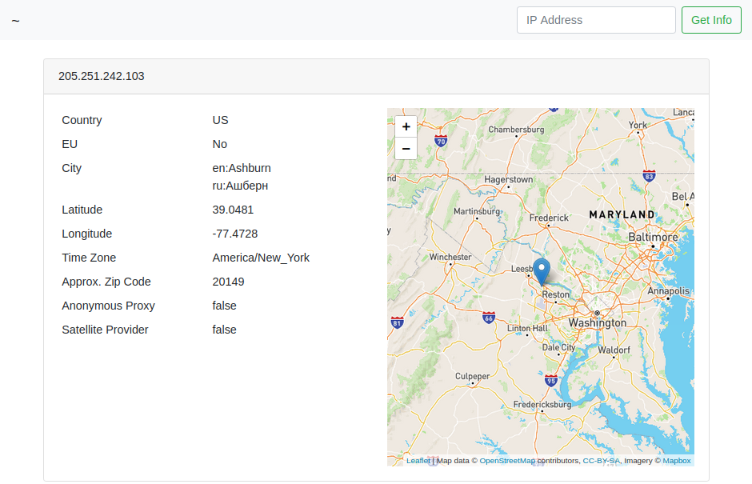

# rest-geoip

[](https://goreportcard.com/report/github.com/TwistTheNeil/rest-geoip)
[](https://github.com/TwistTheNeil/rest-geoip/actions?query=workflow%3Agolangci-lint)

A self hosted geoip lookup application which provides a client with information about their IP address or any other. It uses the [Maxmind](https://www.maxmind.com) GeoLite2-City database.

The webapp provides general geoip information. There is also an api available

```
GET  /api/ip              : Return client IP Address
GET  /api/geoip           : Return client Geoip information
GET  /api/geoip/:address  : Return Geoip information for "address"
PUT  /api/update          : Update the Maxmind database
```

The application doesn't provide a database. A `PUT` request to `/api/update` will update the database and will ideally be protected by an api key (header: `X-API-KEY`). If `API_KEY` env var is not set, then the application will set one on startup and notify via STDOUT

### Screenshot of optional webapp


### Example nginx config
```
server {
	server_name geoip.domain.com

	listen [::]:443 ssl;
	listen 443 ssl;

	include ssl.conf;

	location / {
	  proxy_set_header        X-Real-IP $remote_addr;
	  proxy_pass              http://localhost:8080/;
	  proxy_read_timeout      600s;
	  proxy_send_timeout      600s;
	}
}
```