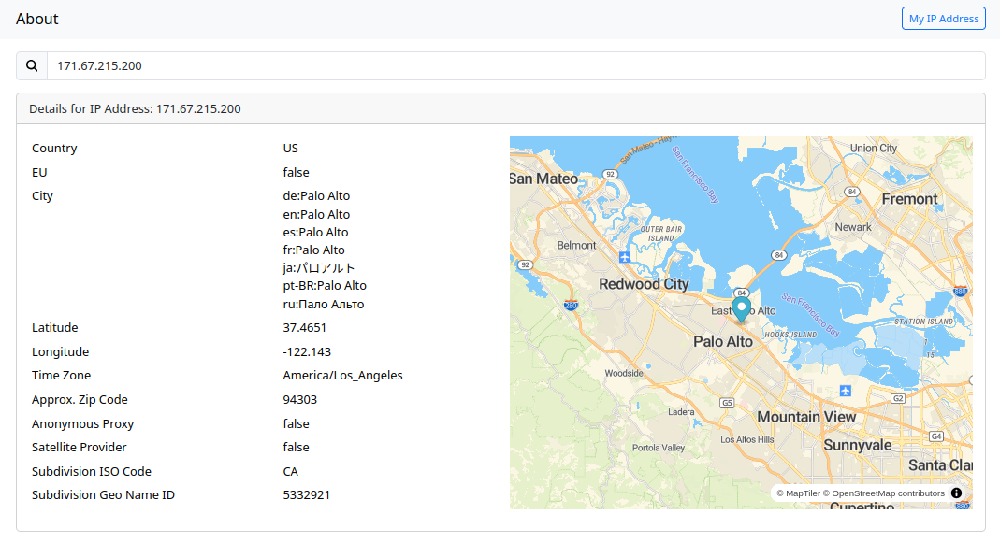

# rest-geoip

[](https://goreportcard.com/report/github.com/TwistTheNeil/rest-geoip)
[](https://github.com/TwistTheNeil/rest-geoip/actions/workflows/docker-build-latest.yml)
[](https://github.com/TwistTheNeil/rest-geoip/actions/workflows/docker-publish-tags.yml)

***For any current or previous stable versions, look in the appropriate tag's branch. [`main`](https://github.com/TwistTheNeil/rest-geoip) will be in continuous development***

A self hosted geoip lookup application written in Go and Vue.js 3 which provides a client with information about their IP address or any other. It uses the [Maxmind](https://www.maxmind.com) GeoLite2-City database.

The webapp provides general geoip information. There is also an api available

```
GET  /                    : Return client IP Address (when used with curl or HTTPie)
GET  /api/geoip           : Return client Geoip information
GET  /api/geoip/:address  : Return Geoip information for "address"
PUT  /api/update          : Update the Maxmind database
```

The application doesn't provide a database. A `PUT` request to `/api/update` will update the database and will ideally be protected by an api key (header: `X-API-KEY`). If `API_KEY` env var is not set, then the application will set one on startup and notify via STDOUT

### Screenshots of optional webapp


### Building and running

#### using docker-compose

```bash
$ docker compose up --build
```

#### using docker-compose for dev

```bash
$ docker compose -f docker-compose.yml -f docker-compose.dev.yml --build
```

#### via npm and go
```bash
$ cd frontend
$ pnpm install
$ npm run build
$ cd ../
$ go build
```

#### via docker

```bash
$ docker build .
```

The go binary will have the vue app embedded and serve it if `WEB` is enabled.
the binary will serve the embedded app in production mode (`RELEASE_MODE` = `true`). Or it will look at the filesystem for a `dist/` and serve that if it's not in production mode
